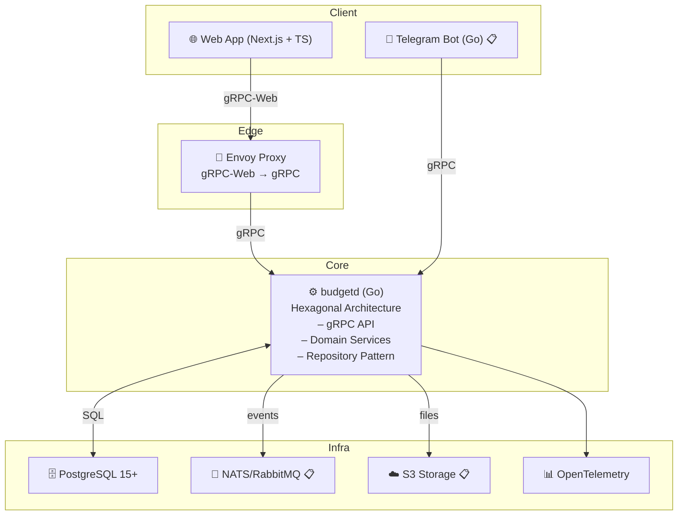

# 💰 Budget - Многопользовательский учет доходов и расходов

[](https://golang.org/)
[](https://nextjs.org/)
[](https://www.typescriptlang.org/)
[](https://www.postgresql.org/)
[](https://www.docker.com/)

[](https://github.com/your-username/budget/actions)
[](https://github.com/your-username/budget/actions)
[](LICENSE)
[](http://makeapullrequest.com)

[English](README_EN.md) | [Русский](README.md)

> Современное веб-приложение для учета личных финансов с поддержкой многопользовательности, импорта/экспорта данных и красивым интерфейсом.

## 🚀 Быстрый старт

### Предварительные требования
- Docker и Docker Compose
- Git

### Установка и запуск
```bash
# Клонирование репозитория
git clone <repository>
cd budget

# Запуск всего окружения
make up

# Проверка статуса
make logs
```

### Доступ к сервисам
- 🌐 **Frontend**: http://localhost:3030
- 🔧 **Backend gRPC**: localhost:8080
- 📊 **Grafana**: http://localhost:3002
- 📈 **Prometheus**: http://localhost:9090

### Первые шаги
1. Откройте http://localhost:3030
2. Зарегистрируйтесь с email/паролем
3. Создайте первую организацию
4. Начните добавлять категории и транзакции

## ✨ Основные возможности

### 💳 Управление транзакциями
- ✅ CRUD операции с транзакциями (доходы/расходы)
- ✅ Категоризация с поддержкой i18n
- ✅ Фильтрация и поиск с быстрыми фильтрами
- ✅ Пагинация и сортировка
- ✅ Экспорт в CSV с фильтрами
- ✅ Быстрые фильтры (текущий месяц, прошлый месяц, год, 30 дней)

### 📊 Аналитика и отчеты
- ✅ Месячные отчеты по категориям
- ✅ Визуализация данных с графиками
- ✅ Сравнение периодов
- ✅ Статистика доходов и расходов

### 🔄 Импорт/Экспорт данных
- ✅ Импорт CSV файлов с настройкой маппинга
- ✅ Автоматическое определение кодировки
- ✅ Предварительный просмотр данных
- ✅ Экспорт с учетом всех фильтров

### 👥 Многопользовательность
- ✅ Multi-tenant архитектура
- ✅ Роли: Owner, Admin, Member
- ✅ Управление организациями
- ✅ Изоляция данных между аккаунтами

### 🌍 Интернационализация
- ✅ Поддержка русского и английского языков
- ✅ Локализованные категории
- ✅ Автоматическое переключение языков

## 🏗️ Архитектура



## 🛠️ Технологический стек

### Backend
- **Go 1.23+** - основной язык сервера
- **gRPC** - API протокол с protobuf
- **PostgreSQL 15+** - основная база данных
- **Argon2id** - хеширование паролей
- **JWT** - аутентификация с refresh токенами

### Frontend
- **Next.js 14** - React фреймворк
- **TypeScript** - типизированный JavaScript
- **Tailwind CSS** - утилитарный CSS фреймворк
- **TanStack Query** - управление состоянием
- **Connect-Web** - gRPC клиент для браузера

### DevOps
- **Docker** - контейнеризация
- **Prometheus + Grafana** - мониторинг
- **OpenTelemetry** - трейсинг и метрики
- **GitHub Actions** - CI/CD

## 📊 Статус реализации

| Компонент | Статус | Описание |
|-----------|--------|----------|
| 🔐 **Аутентификация** | ✅ Готово | Регистрация, вход, JWT токены |
| 👤 **Пользователи** | ✅ Готово | Профили, смена пароля |
| 🏢 **Организации** | ✅ Готово | Multi-tenant, роли |
| 📂 **Категории** | ✅ Готово | CRUD с i18n |
| 💰 **Транзакции** | ✅ Готово | CRUD, фильтры, пагинация |
| 📈 **Отчеты** | ✅ Готово | Месячная аналитика |
| 💱 **Курсы валют** | ✅ Готово | Управление FX |
| 📥 **Импорт** | ✅ Готово | CSV с маппингом |
| 📤 **Экспорт** | ✅ Готово | CSV с фильтрами |
| 🌐 **Frontend** | ✅ Готово | Современный UI/UX |
| 📊 **Мониторинг** | ✅ Готово | Prometheus + Grafana |
| 🧪 **Тесты** | ✅ Готово | Unit + Integration |

## 🧪 Тестирование

```bash
# Backend тесты
make test

# Frontend тесты
cd web && npm test

# Все тесты
make check
```

**Результаты тестов:**
- ✅ **13 тестов** - все проходят
- ✅ **Backend** - unit и integration тесты
- ✅ **Frontend** - компонентные тесты
- ✅ **API** - gRPC интеграционные тесты

### Frontend
- **Next.js 14** - React фреймворк
- **TypeScript** - типизированный JavaScript
- **Tailwind CSS** - утилитарный CSS фреймворк
- **TanStack Query** - управление состоянием
- **Connect-Web** - gRPC клиент для браузера

### DevOps
- **Docker** - контейнеризация
- **Prometheus + Grafana** - мониторинг
- **OpenTelemetry** - трейсинг и метрики
- **GitHub Actions** - CI/CD

## 📊 Статус реализации

| Компонент | Статус | Описание |
|-----------|--------|----------|
| 🔐 **Аутентификация** | ✅ Готово | Регистрация, вход, JWT токены |
| 👤 **Пользователи** | ✅ Готово | Профили, смена пароля |
| 🏢 **Организации** | ✅ Готово | Multi-tenant, роли |
| 📂 **Категории** | ✅ Готово | CRUD с i18n |
| 💰 **Транзакции** | ✅ Готово | CRUD, фильтры, пагинация |
| 📈 **Отчеты** | ✅ Готово | Месячная аналитика |
| 💱 **Курсы валют** | ✅ Готово | Управление FX |
| 📥 **Импорт** | ✅ Готово | CSV с маппингом |
| 📤 **Экспорт** | ✅ Готово | CSV с фильтрами |
| 🌐 **Frontend** | ✅ Готово | Современный UI/UX |
| 📊 **Мониторинг** | ✅ Готово | Prometheus + Grafana |
| 🧪 **Тесты** | ✅ Готово | Unit + Integration |


## 🚀 Развертывание

### Локальная разработка
```bash
# Запуск всего окружения
make up

# Остановка
make down

# Проверки
make check

# Генерация protobuf
make proto

# Миграции БД
make migrate-up
```

### Продакшн
```bash
# Сборка и запуск
docker-compose -f docker-compose.yml up -d

# Мониторинг
docker-compose -f docker-compose.yml logs -f
```

## 📁 Структура проекта

```
budget/
├── 📁 cmd/budgetd/              # Backend entry point
├── 📁 internal/                 # Backend business logic
│   ├── 📁 domain/              # Domain entities
│   ├── 📁 usecase/             # Application services
│   ├── 📁 adapter/             # Infrastructure adapters
│   └── 📁 pkg/                 # Shared utilities
├── 📁 web/                     # Frontend (Next.js)
│   ├── 📁 app/                 # Next.js App Router
│   ├── 📁 components/          # React components
│   ├── 📁 lib/                 # Utilities and API clients
│   └── 📁 i18n/                # Internationalization
├── 📁 proto/                   # gRPC schemas
├── 📁 migrations/              # Database migrations
├── 📁 deploy/                  # Docker and monitoring
└── 📁 docs/                    # Documentation
```

## 🔧 Основные команды

| Команда | Описание |
|---------|----------|
| `make up` | Запуск всего окружения |
| `make down` | Остановка всех сервисов |
| `make check` | Проверки backend + frontend |
| `make proto` | Генерация protobuf кода |
| `make migrate-up` | Применение миграций БД |
| `make test` | Запуск тестов |
| `make logs` | Просмотр логов |

## 🌍 Интернационализация

Приложение полностью поддерживает **русский** и **английский** языки:

- ✅ **Backend**: i18n для категорий и сообщений
- ✅ **Frontend**: полная локализация интерфейса
- ✅ **Автоматическое переключение** языков
- ✅ **Сохранение** выбранного языка в профиле

## 🔐 Безопасность

- ✅ **Argon2id** хеширование паролей
- ✅ **JWT** с access/refresh токенами
- ✅ **Multi-tenant** изоляция данных
- ✅ **Роли** в аккаунтах (Owner/Admin/Member)
- ✅ **Валидация** на всех уровнях
- ✅ **Автоматическое обновление** токенов

## 📈 Мониторинг

- ✅ **Prometheus** метрики
- ✅ **OpenTelemetry** трейсинг
- ✅ **Grafana** дашборды
- ✅ **Структурированное** логирование

## 🎨 UI/UX

- ✅ **Современный дизайн** с Tailwind CSS
- ✅ **Адаптивная верстка** для всех устройств
- ✅ **Плавные анимации** и переходы
- ✅ **Интуитивная навигация**
- ✅ **Обратная связь** для всех действий

## 📋 Roadmap

### 🚧 В разработке
- 📱 **Telegram бот** для быстрого добавления транзакций
- 🏦 **Интеграции с банками** для автоматического импорта
- 📊 **Планирование бюджета** и финансовые цели

### 🔮 Планируется
- 📱 **Мобильное приложение** (React Native)
- 🧪 **E2E тесты** с Playwright
- ⚡ **Performance оптимизации**
- 📱 **PWA функциональность**
- 🔄 **Оффлайн режим**
- 🔔 **Push уведомления**

## 🤝 Вклад в проект

Мы приветствуем вклад в развитие проекта! Пожалуйста, ознакомьтесь с нашими [правилами контрибьюции](CONTRIBUTING.md).

### Как помочь:
1. 🐛 **Сообщить о баге** - создайте issue
2. 💡 **Предложить идею** - создайте feature request
3. 🔧 **Исправить баг** - создайте pull request
4. 📚 **Улучшить документацию** - отредактируйте README

## 📄 Лицензия

Этот проект лицензирован под MIT License - см. файл [LICENSE](LICENSE) для деталей.

## 🙏 Благодарности

- [Go](https://golang.org/) - за отличный язык программирования
- [Next.js](https://nextjs.org/) - за современный React фреймворк
- [Tailwind CSS](https://tailwindcss.com/) - за утилитарный CSS
- [gRPC](https://grpc.io/) - за эффективный API протокол

---

**⭐ Если проект вам понравился, поставьте звездочку!**

**Статус проекта**: ✅ **MVP готов к использованию**

Все основные функции реализованы и протестированы. Приложение готово для использования в продакшене с базовым функционалом учета личных финансов.


