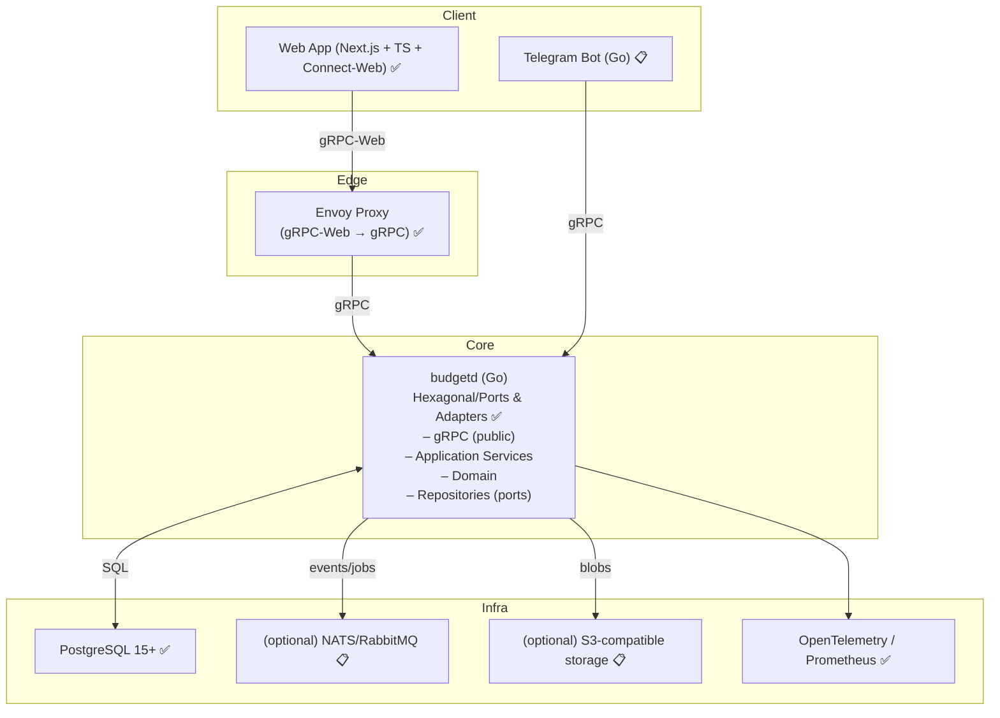

## Budget: многопользовательский учет доходов и расходов (gRPC + Go + Next.js)

Этот документ описывает целевую архитектуру и API-first спецификацию сервиса учета личных финансов с перспективой масштабирования в SaaS. Ядро — сервис на Go, протокол взаимодействия — gRPC. Web‑клиент на Next.js взаимодействует через gRPC‑Web.

### 🎯 Цели и требования

- ✅ Собственная БД для хранения данных (PostgreSQL)
- ✅ Многопользовательность и многоарендность (multi‑tenant) с регистрацией по email/паролю
- ✅ Базовый функционал:
  - ✅ CRUD по транзакциям (доход/расход, категория, дата, сумма, комментарий)
  - ✅ Управление категориями (отдельно доходы/расходы) с i18n
  - ✅ Список транзакций с фильтрами и пагинацией
  - ✅ Краткая сводка по месяцам (доходы/расходы по категориям)
- ✅ Архитектура с четким разделением:
  - ✅ Ядро: сервис на Go не знает про UI и конкретные интерфейсы, только про доменную модель и порты
  - ✅ Отдельный фронтенд как независимое web‑приложение (Next.js)
- 🟡 На перспективу:
  - ✅ i18n интерфейса и данных (категорий)
  - 📋 Телеграм‑бот для добавления транзакций
  - 📋 Импорт CSV с сопоставлением колонок и категорий
  - 📋 Выгрузка отчетов в XLSX
  - 📋 Интеграции с банками/выписками

### 🏗️ Высокоуровневая архитектура



### 🛠️ Технологический стек

- **Backend**: Go 1.23+, gRPC (google.golang.org/grpc), protobuf v3, Buf (buf.build) для схем и генерации ✅
- **API transport**: gRPC (основной), gRPC‑Web через Envoy (для браузера) ✅
- **Frontend**: Next.js 14 (React + TS), `@connectrpc/connect-web` клиент, Tailwind CSS, TanStack Query ✅
- **DB**: PostgreSQL 15+, миграции `golang-migrate` (SQL миграции), UUID v4, NUMERIC для денег и курсов ✅
- **Аутентификация**: email/пароль, Argon2id для хеширования, JWT (access+refresh), tenant_id в клаймах ✅
- **Обсервабилити**: OpenTelemetry (traces/metrics), Prometheus, Zap/Zerolog для логирования ✅

### 📊 Статус реализации

#### Backend ✅ Готово
- ✅ **Auth**: Register/Login/Refresh с JWT токенами
- ✅ **User**: профиль пользователя, смена пароля
- ✅ **Tenant**: создание и управление организациями
- ✅ **Category**: CRUD категорий с i18n поддержкой
- ✅ **Transaction**: CRUD транзакций с фильтрами и пагинацией
- ✅ **Report**: месячные отчеты по категориям
- ✅ **Fx**: управление курсами валют
- ✅ **Import**: скелет для будущего CSV импорта
- ✅ **Observability**: Prometheus метрики, OpenTelemetry трейсинг
- ✅ **Security**: Argon2id хеширование, JWT с refresh токенами

#### Frontend ✅ Готово
- ✅ **Auth**: страницы входа и регистрации с современным дизайном
- ✅ **Navigation**: адаптивная навигация с переключением локали
- ✅ **Categories**: управление категориями с inline-редактированием
- ✅ **Transactions**: список с фильтрами, пагинацией, CRUD операциями
- ✅ **Reports**: месячные отчеты с выбором периода и валюты
- ✅ **Fx**: просмотр и изменение курсов валют
- ✅ **Profile**: настройки профиля и смена пароля
- ✅ **Tenants**: управление организациями и переключение между ними
- ✅ **i18n**: полная поддержка русского и английского языков
- ✅ **UX/UI**: современный дизайн с адаптивностью и анимациями
- ✅ **Auto-refresh**: автоматическое обновление access токенов

#### DevOps ✅ Готово
- ✅ **CI/CD**: GitHub Actions с проверками backend и frontend
- ✅ **Docker**: контейнеризация всех компонентов
- ✅ **Monitoring**: Prometheus + Grafana дашборды
- ✅ **Testing**: unit и integration тесты

### 🚀 Быстрый старт

1. **Клонирование и настройка**:
```bash
git clone <repository>
cd budget
make up
```

2. **Доступ к приложению**:
- Frontend: http://localhost:3000
- Backend gRPC: localhost:8080
- Envoy (gRPC-Web): localhost:8081
- Grafana: http://localhost:3001

3. **Регистрация и использование**:
- Откройте http://localhost:3000
- Зарегистрируйтесь с email/паролем
- Создайте первую организацию
- Начните добавлять категории и транзакции

### 📁 Структура проекта

```
.
├── cmd/budgetd/                 # Backend entry point ✅
├── internal/                    # Backend business logic ✅
│   ├── domain/                  # Domain entities
│   ├── usecase/                 # Application services
│   ├── adapter/                 # Infrastructure adapters
│   └── pkg/                     # Shared utilities
├── web/                         # Frontend (Next.js) ✅
│   ├── app/                     # Next.js App Router
│   ├── components/              # React components
│   ├── lib/                     # Utilities and API clients
│   └── i18n/                    # Internationalization
├── proto/                       # gRPC schemas ✅
├── migrations/                  # Database migrations ✅
├── deploy/                      # Docker and monitoring ✅
└── docs/                        # Documentation
```

### 🔧 Основные команды

```bash
# Запуск всего окружения
make up

# Остановка
make down

# Проверки (backend + frontend)
make check

# Генерация protobuf кода
make proto

# Миграции БД
make migrate-up
make migrate-down

# Тесты
make test
cd web && npm test
```

### 🌍 Интернационализация

Приложение полностью поддерживает русский и английский языки:
- ✅ Backend: i18n для категорий
- ✅ Frontend: полная локализация интерфейса
- ✅ Автоматическое переключение языков
- ✅ Сохранение выбранного языка в профиле

### 🔐 Безопасность

- ✅ Argon2id хеширование паролей
- ✅ JWT с access/refresh токенами
- ✅ Автоматическое обновление токенов
- ✅ Multi-tenant изоляция данных
- ✅ Валидация на всех уровнях

### 📈 Мониторинг

- ✅ Prometheus метрики
- ✅ OpenTelemetry трейсинг
- ✅ Grafana дашборды
- ✅ Логирование с структурированными логами

### 🎨 UI/UX

- ✅ Современный дизайн с Tailwind CSS
- ✅ Адаптивная верстка для всех устройств
- ✅ Плавные анимации и переходы
- ✅ Интуитивная навигация
- ✅ Обратная связь для всех действий

### 📋 Что дальше

#### Планируемые функции:
- 📋 Telegram бот для быстрого добавления транзакций
- 📋 Импорт CSV файлов с автоматической категоризацией
- 📋 Экспорт отчетов в XLSX
- 📋 Интеграции с банками для автоматического импорта
- 📋 Планирование бюджета и финансовые цели
- 📋 Мобильное приложение

#### Технические улучшения:
- 📋 E2E тесты с Playwright
- 📋 Performance оптимизации
- 📋 PWA функциональность
- 📋 Оффлайн режим
- 📋 Push уведомления

---

**Статус проекта**: ✅ MVP готов к использованию

Все основные функции реализованы и протестированы. Приложение готово для использования в продакшене с базовым функционалом учета личных финансов.


