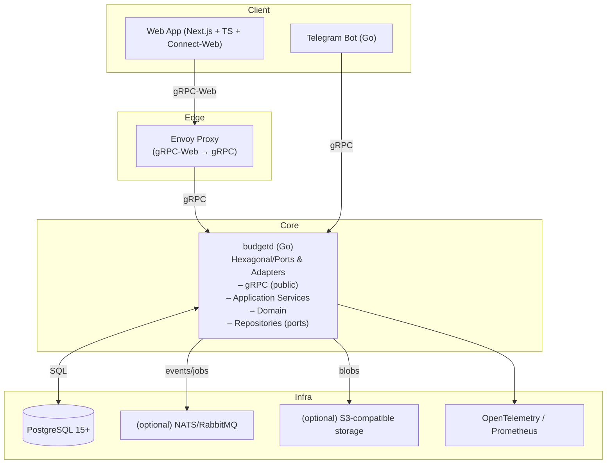

## Budget: многопользовательский учет доходов и расходов (gRPC + Go)

Этот документ описывает целевую архитектуру и API-first спецификацию сервиса учета личных финансов с перспективой масштабирования в SaaS. Ядро — сервис на Go, протокол взаимодействия — gRPC. Отдельный web‑клиент (SPA/SSR) взаимодействует через gRPC‑Web.

### Цели и требования

- Собственная БД для хранения данных.
- Многопользовательность и многоарендность (multi‑tenant) с регистрацией по email/паролю.
- Базовый функционал:
  - CRUD по транзакциям (доход/расход, категория, дата, сумма, комментарий).
  - Управление категориями (отдельно доходы/расходы) с i18n.
  - Список транзакций с фильтрами и пагинацией.
  - Краткая сводка по месяцам (доходы/расходы по категориям).
- Архитектура с четким разделением:
  - Ядро: сервис на Go не знает про UI и конкретные интерфейсы, только про доменную модель и порты.
  - Отдельный фронтенд как независимое web‑приложение.
- На перспективу:
  - i18n интерфейса и данных (категорий).
  - Телеграм‑бот для добавления транзакций.
  - Импорт CSV с сопоставлением колонок и категорий.
  - Выгрузка отчетов в XLSX.
  - Интеграции с банками/выписками.

### Высокоуровневая архитектура



### Технологический стек

- Backend: Go 1.23+, gRPC (google.golang.org/grpc), protobuf v3, Buf (buf.build) для схем и генерации.
- API transport: gRPC (основной), gRPC‑Web через Envoy (для браузера) или connect-go/grpcweb wrapper.
- Frontend: Next.js 14 (React + TS), `@connectrpc/connect-web` клиент, Tailwind CSS, TanStack Query.
- DB: PostgreSQL 15+, миграции `golang-migrate` (SQL миграции), UUID v4, NUMERIC для денег и курсов.
- Аутентификация: email/пароль, Argon2id для хеширования, JWT (access+refresh), tenant_id в клаймах.
- Обсервабилити: OpenTelemetry (traces/metrics), Prometheus, Zap/Zerolog для логирования.

### Архитектурные принципы (Hexagonal)

- Domain слой содержит бизнес‑сущности и правила, не зависит от external libs.
- Application сервисы реализуют use‑cases, опираясь на порты (интерфейсы репозиториев и интеграций).
- Adapters покрывают:
  - gRPC transport (server): сериализация/валидация/форматирование ответа.
  - DB (PostgreSQL) репозитории: работа с SQL без бизнес‑логики.
  - Auth/JWT, PasswordHasher.
  - Integrations: Telegram, импорт/экспорт, банки (по мере внедрения).

Потоки данных: контроллер (gRPC handler) → валидация → application service → репозитории → домен → ответ.

### Многоарендность (multi‑tenant)

- Модель: один пользователь может принадлежать нескольким арендаторам (тенантам). Все бизнес‑данные привязаны к `tenant_id`.
- Изоляция: на уровне БД столбец `tenant_id` + (опционально) Row Level Security (RLS) с политиками.
- Авторизация: JWT включает `sub` (user_id) и `tenant_id`. Клиент может переключать активного арендатора — новый JWT или метаданные `x-tenant-id`.
- Роли: OWNER, ADMIN, MEMBER (минимальный RBAC).

### Модель данных (упрощенная)

- tenants(id uuid, name, slug, default_currency, created_at)
- users(id uuid, email unique, name, locale, password_hash, email_verified, created_at)
- user_tenants(user_id, tenant_id, role, is_default)
- categories(id uuid, tenant_id, kind income|expense, code, parent_id, is_active, created_at)
- category_i18n(category_id, locale, name, description)
- transactions(id uuid, tenant_id, user_id, category_id, type income|expense, amount numeric(18,2), currency, base_amount numeric(18,2), base_currency, fx_rate numeric(18,8), fx_provider, fx_as_of date, occurred_at timestamptz, comment, created_at)
 - fx_rates(from_currency, to_currency, rate numeric(18,8), as_of date, provider, created_at)

Ключевые индексы: (tenant_id, occurred_at), (tenant_id, category_id), (tenant_id, type, occurred_at), полнотекстовый по комментарию (опционально).

Денежные суммы храним в NUMERIC(18,2) в БД. В API — как `Money { currency_code, minor_units }` (целые минимальные единицы, напр. копейки/центы), чтобы избежать ошибок с float.

### gRPC API (API‑first)

Схемы находятся в `proto/budget/v1/*.proto`. Генерация управляется Buf (`proto/buf.yaml`, `proto/buf.gen.yaml`). Основные сервисы:

- AuthService: регистрация, логин, refresh, восстановление пароля.
- UserService: профиль текущего пользователя.
- TenantService: создание и получение своих арендаторов.
- CategoryService: CRUD категорий с i18n.
- TransactionService: CRUD транзакций, список с фильтрами/пагинацией.
- ReportService: месячная сводка доходов/расходов по категориям (в целевой валюте).
- FxService: получение/запись курсов валют.
- ImportService: задел под CSV‑импорт (streaming upload, mapping, preview, commit).

Общие типы в `common.proto`: `Money`, `FxInfo`, `TransactionType`, `CategoryKind`, `PageRequest/PageResponse`, `DateRange`.

Состояние реализации (backend):
- Готово: Auth (Register/Login/Refresh), User, Tenant (Create/List), Category (CRUD+i18n), Transaction (CRUD+фильтры/пагинация, перерасчет base_amount), Report (MonthlySummary), Fx (Get/Upsert/Batch). Import — скелет для будущей реализации.
- Включена цепочка интерсепторов: Auth/Logging/Recovery/TenantGuard; метрики Prometheus и базовый трейсинг OpenTelemetry.

Аутентификация: передавать `authorization: Bearer <access_token>` в gRPC metadata. Активный тенант — либо в клаймах токена, либо `x-tenant-id` в metadata, если пользователь имеет несколько.

Коды ошибок: стандартные gRPC статус‑коды. Детали (валидация и др.) — через `google.rpc.BadRequest` и `google.rpc.ErrorInfo` (позже).

### Frontend

- Next.js 14 + TypeScript.
- gRPC‑Web клиент: `@connectrpc/connect-web` (поддерживает gRPC/Connect/gRPC‑Web), проксирование через Envoy.
- State/query: TanStack Query.
- i18n: next-intl или i18next.

Фронтенд не содержит бизнес‑логики домена, только представление, валидации форм, локализация и вызовы API. Подробный план фронтенда см. в `FRONTEND_IMPLEMENTATION_PLAN.md`.

### Telegram Bot (план)

Отдельный адаптер/микросервис на Go, использующий gRPC для записи транзакций в ядро. Подключение по Bot API → нормализация входных данных → вызов RPC `CreateTransaction` с учётом карты категорий.

### Импорт CSV и экспорт XLSX (план)

- Импорт: потоковая загрузка файла (client‑streaming), конфигурация маппинга колонок → preview (валидные/ошибочные) → commit (batch insert с транзакцией). Хранение сырья в S3‑совместимом сторедже (minio) опционально.
- Экспорт: генерация XLSX по периодам/категориям server‑streaming или через job + последующая загрузка.

### Сборка и генерация кода

Требуется `buf` и `protoc`.

- Конфигурация Buf: `proto/buf.yaml`, генерация: `proto/buf.gen.yaml`.
- Пример генерации:

```bash
cd proto
buf lint
buf generate
```

Это создаст артефакты клиента/сервера (пути задаются в `buf.gen.yaml`). Для Go генерируется в `gen/go`, для web‑клиента — в `gen/ts`.

Если нет локально установленного `buf`, можно использовать docker:

```bash
make dproto
```

### Мультивалютность

- У каждого арендатора есть базовая валюта (`tenants.default_currency`).
- Транзакции могут быть в любой валюте: сохраняем оригинальную сумму/валюту и одновременно `base_amount` в базовой валюте арендатора.
- Конвертация происходит по курсу на дату транзакции (`fx_as_of = occurred_at::date`). Курс берется из хранилища курсов (таблица `fx_rates`) или через интеграцию провайдера (например, ЦБ РФ/ECB), после чего кешируется.
- В списках показываем оригинальные суммы, в отчетах/сводках — агрегаты в целевой валюте (по умолчанию базовая валюта арендатора; можно указать иную целевую валюта в запросе отчета).
- Для точности в API курс представляется десятичной строкой, в БД — NUMERIC(18,8), суммы — NUMERIC(18,2).

### Запуск окружения (dev, минимально)

- PostgreSQL (Docker):
  - DB: `budget` / user: `budget` / password: `budget`.
- Envoy (Docker) как gRPC‑Web прокси к `budgetd`.
- Миграции: `golang-migrate` против локальной БД.
- `budgetd` запускается на :8080 (gRPC). Envoy слушает :8081 (gRPC‑Web) → проксирует на :8080.

Переменные окружения:
- `GRPC_ADDR` — адрес gRPC (по умолчанию `:8080`)
- `DATABASE_URL` — строка подключения к PostgreSQL
- `JWT_SIGN_KEY`, `JWT_ACCESS_TTL`, `JWT_REFRESH_TTL`
- `METRICS_ADDR` — адрес HTTP сервера метрик Prometheus (например, `:9090`)
- `OTEL_EXPORTER_OTLP_ENDPOINT` — OTLP/HTTP endpoint (например, `otel-collector:4318`), `OTEL_EXPORTER_OTLP_INSECURE=true`

Включение интерсепторов:
- В `cmd/budgetd/main.go` включены: `Auth`, `Logging`, `Recovery`, `TenantGuard` (проверка членства в активном тенанте).

### Проверки локально

Используем цель `check`, чтобы запустить все необходимые проверки так же, как в CI:

```bash
make check
# включает: go mod tidy, форматирование (gofumpt/gofmt), vet, golangci-lint (в docker), тесты

# интеграционные тесты репозиториев PostgreSQL (testcontainers)
make pgtest
```

### Быстрые команды (Makefile)

```bash
# собрать бинарь
make build

# поднять окружение (db, app, envoy)
make up

# посмотреть состояние
make ps

# логи
make logs

# сгенерировать gRPC код из protobuf
make proto

# применить миграции (после их добавления)
make migrate-up

# остановить окружение и удалить volume с БД
make down
```

### Безопасность

- Пароли — Argon2id, параметризуемые cost‑параметры.
- JWT: короткоживущий access и долгоживущий refresh. Хранение и ротация refresh в БД.
- Валидация входа в gRPC‑хэндлерах + проверка принадлежности к `tenant_id`.
- Политики RLS в PostgreSQL (рекомендуется) + индексы по `tenant_id`.
- Аудит‑лог ключевых операций (позже через outbox/stream).

### Каталожная структура (целевой вид)

```
.
├── cmd/
│   └── budgetd/                # main.go, wire/bootstrap
├── internal/
│   ├── domain/                 # entity, value objects, errors
│   ├── usecase/                # application services (интерфейсы портов)
│   ├── adapter/
│   │   ├── grpc/               # server handlers (controllers)
│   │   ├── postgres/           # repositories (SQL/queries)
│   │   ├── auth/               # JWT, password hasher
│   │   └── telegram/           # bot adapter (позже)
│   └── pkg/                    # shared utils (logger, config)
├── migrations/                 # SQL миграции
├── proto/
│   ├── buf.yaml
│   ├── buf.gen.yaml
│   └── budget/v1/*.proto       # в т.ч. fx.proto (курсы)
├── .github/workflows/ci.yml     # GitHub Actions (buf lint, golangci-lint, tests)
├── Makefile                     # proto/dproto, build, up/down, check, dmigrate-*
├── gen/
│   ├── go/                     # сгенерированные Go stubs
│   └── ts/                     # сгенерированные TS клиенты
└── web/                        # фронтенд (Next.js)
```

### Примеры вызовов (grpcurl)

- Login:

```bash
grpcurl -plaintext \
  -d '{"email":"user@example.com","password":"pass"}' \
  localhost:8080 budget.v1.AuthService/Login
```

- Список транзакций (с токеном и активным тенантом):

```bash
grpcurl -plaintext \
  -H "authorization: Bearer <ACCESS>" \
  -H "x-tenant-id: <TENANT_UUID>" \
  -d '{"page":{"page":1,"page_size":50},"date_range":{}}' \
  localhost:8080 budget.v1.TransactionService/ListTransactions
```

### Дальнейшее развитие

### Observability (Prometheus/Grafana)

Запуск Prometheus+Grafana (профиль `obs`) и экспорта метрик:

```bash
METRICS_ADDR=:9090 docker compose --profile obs up -d --build
```

Prometheus читает метрики по адресу `app:9090`. Grafana доступна на `http://localhost:3000` (анонимный доступ включён), предустановлены дашборды в `deploy/grafana/dashboards`.

Алерты Prometheus подключаются из `deploy/alert.rules.yml`.

#### Локальный запуск с метриками и трейсингом (пример)

```bash
export GRPC_ADDR=:8080
export METRICS_ADDR=:9090
export JWT_SIGN_KEY=dev-secret
export OTEL_EXPORTER_OTLP_ENDPOINT=localhost:4318
export OTEL_EXPORTER_OTLP_INSECURE=true

docker compose --profile obs up -d otel-collector prometheus grafana
go run ./cmd/budgetd
```

- Импорт/экспорт, интеграции с банками (парсеры/коннекторы), автоматическая категоризация.
- Планирование бюджета и цели, теги, вложенные категории.
- Нотификации, webhooks, публичный SDK.

---

См. protobuf‑схемы в `proto/budget/v1` для детальной спецификации RPC и сообщений.


