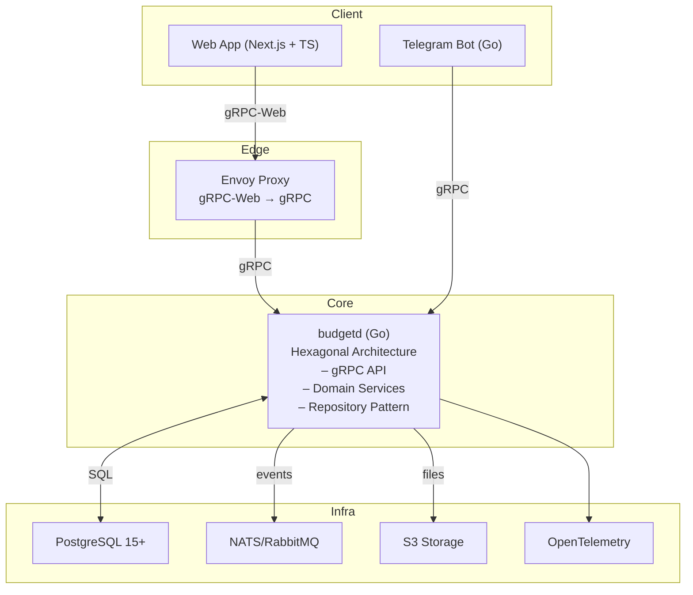

# Budget - Многопользовательский учет доходов и расходов

**Технологии**

[](https://golang.org/) [](https://nextjs.org/) [](https://www.typescriptlang.org/) [](https://www.postgresql.org/) [](https://www.docker.com/)

**Статус проекта**

[](https://github.com/positron48/budget/actions/workflows/ci.yml) [](https://github.com/positron48/budget/actions/workflows/security.yml) [](https://github.com/positron48/budget/actions/workflows/generate-stubs.yml) [](https://goreportcard.com/report/github.com/positron48/budget) [](https://codecov.io/gh/positron48/budget) [](https://dependabot.com/)

**Лицензия и участие**

[](LICENSE) [](http://makeapullrequest.com)

**Статистика**

[](https://github.com/positron48/budget/graphs/contributors) [](https://github.com/positron48/budget/commits) [](https://github.com/positron48/budget/releases)

[English](README_EN.md) | [Русский](README.md)

> Современное веб-приложение для учета личных финансов с поддержкой многопользовательности, импорта/экспорта данных и красивым интерфейсом.

## Быстрый старт

### Предварительные требования
- Docker и Docker Compose
- Git

### Установка и запуск
```bash
# Клонирование репозитория
git clone https://github.com/positron48/budget
cd budget

# Запуск всего окружения
make up

# Проверка статуса
make logs
```

### Доступ к сервисам
- **Frontend**: http://localhost:3030
- **Backend gRPC**: localhost:8080
- **Grafana**: http://localhost:3002
- **Prometheus**: http://localhost:9090

### Первые шаги
1. Откройте http://localhost:3030
2. Зарегистрируйтесь с email/паролем
3. Создайте первую организацию
4. Начните добавлять категории и транзакции

## Основные возможности

<div align="center">

[](https://github.com/positron48/budget#-управление-транзакциями)
[](https://github.com/positron48/budget#-аналитика-и-отчеты)
[](https://github.com/positron48/budget#-импортэкспорт-данных)
[](https://github.com/positron48/budget#-многопользовательность)
[](https://github.com/positron48/budget#-интернационализация)

</div>

### Управление транзакциями
- CRUD операции с транзакциями (доходы/расходы)
- Категоризация с поддержкой i18n
- Фильтрация и поиск с быстрыми фильтрами
- Пагинация и сортировка
- Экспорт в CSV с фильтрами
- Быстрые фильтры (текущий месяц, прошлый месяц, год, 30 дней)

### Аналитика и отчеты
- Месячные отчеты по категориям
- Визуализация данных с графиками
- Сравнение периодов
- Статистика доходов и расходов

### Импорт/Экспорт данных
- Импорт CSV файлов с настройкой маппинга
- Автоматическое определение кодировки
- Предварительный просмотр данных
- Экспорт с учетом всех фильтров

### Многопользовательность
- Multi-tenant архитектура
- Роли: Owner, Admin, Member
- Управление организациями
- Изоляция данных между аккаунтами

### Интернационализация
- Поддержка русского и английского языков
- Локализованные категории
- Автоматическое переключение языков

## Архитектура



## Технологический стек

### Backend
- **Go 1.23+** - основной язык сервера
- **gRPC** - API протокол с protobuf
- **PostgreSQL 15+** - основная база данных
- **Argon2id** - хеширование паролей
- **JWT** - аутентификация с refresh токенами

### Frontend
- **Next.js 14** - React фреймворк
- **TypeScript** - типизированный JavaScript
- **Tailwind CSS** - утилитарный CSS фреймворк
- **TanStack Query** - управление состоянием
- **Connect-Web** - gRPC клиент для браузера

### DevOps
- **Docker** - контейнеризация
- **Prometheus + Grafana** - мониторинг
- **OpenTelemetry** - трейсинг и метрики
- **GitHub Actions** - CI/CD

## Развертывание

### Локальная разработка
```bash
# Запуск всего окружения
make up

# Остановка
make down

# Проверки
make check

# Генерация protobuf
make proto

# Миграции БД
make migrate-up
```

### Продакшн
```bash
# Сборка и запуск
docker-compose -f docker-compose.yml up -d

# Мониторинг
docker-compose -f docker-compose.yml logs -f
```

## Структура проекта

```
budget/
├── 📁 cmd/budgetd/              # Backend entry point
├── 📁 internal/                 # Backend business logic
│   ├── 📁 domain/              # Domain entities
│   ├── 📁 usecase/             # Application services
│   ├── 📁 adapter/             # Infrastructure adapters
│   └── 📁 pkg/                 # Shared utilities
├── 📁 web/                     # Frontend (Next.js)
│   ├── 📁 app/                 # Next.js App Router
│   ├── 📁 components/          # React components
│   ├── 📁 lib/                 # Utilities and API clients
│   └── 📁 i18n/                # Internationalization
├── 📁 proto/                   # gRPC schemas
├── 📁 migrations/              # Database migrations
├── 📁 deploy/                  # Docker and monitoring
└── 📁 docs/                    # Documentation
```

## Основные команды

| Команда | Описание |
|---------|----------|
| `make up` | Запуск всего окружения |
| `make down` | Остановка всех сервисов |
| `make check` | Проверки backend + frontend |
| `make proto` | Генерация protobuf кода |
| `make migrate-up` | Применение миграций БД |
| `make test` | Запуск тестов |
| `make logs` | Просмотр логов |

## Roadmap

### В разработке
- **Telegram бот** для быстрого добавления транзакций
- **Интеграции с банками** для автоматического импорта
- **Планирование бюджета** и финансовые цели

### Планируется
- **Мобильное приложение** (React Native)
- **E2E тесты** с Playwright
- **Performance оптимизации**
- **PWA функциональность**
- **Оффлайн режим**
- **Push уведомления**

## Вклад в проект

Мы приветствуем вклад в развитие проекта! Пожалуйста, ознакомьтесь с нашими [правилами контрибьюции](CONTRIBUTING.md).

### Как помочь:
1. **Сообщить о баге** - создайте issue
2. **Предложить идею** - создайте feature request
3. **Исправить баг** - создайте pull request
4. **Улучшить документацию** - отредактируйте README

## Лицензия

Этот проект лицензирован под Creative Commons Attribution-NonCommercial 4.0 International License - см. файл [LICENSE](LICENSE) для деталей.

## Благодарности

- [Go](https://golang.org/) - за отличный язык программирования
- [Next.js](https://nextjs.org/) - за современный React фреймворк
- [Tailwind CSS](https://tailwindcss.com/) - за утилитарный CSS
- [gRPC](https://grpc.io/) - за эффективный API протокол

---

**⭐ Если проект вам понравился, поставьте звездочку!**


