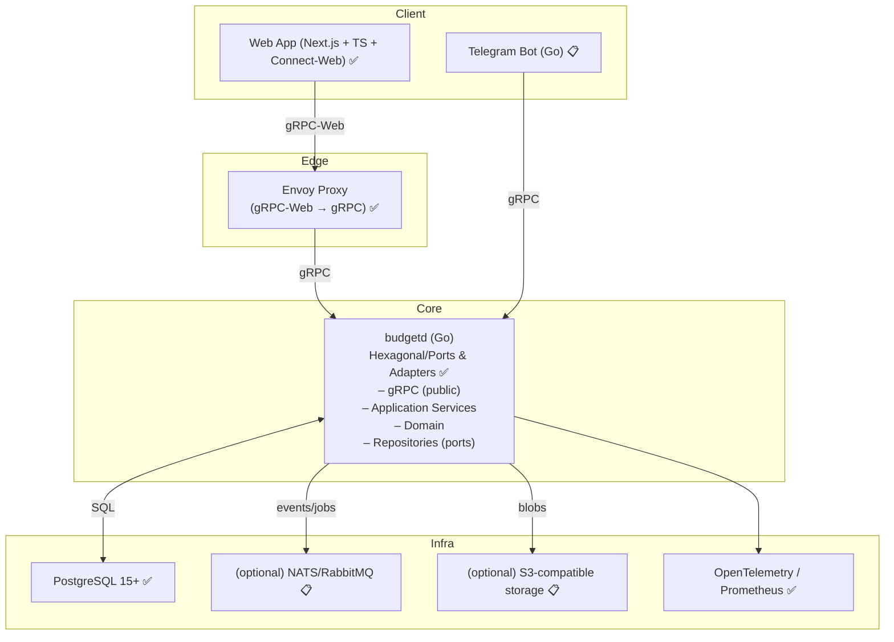

# Budget: Multi-user Income and Expense Tracking (gRPC + Go + Next.js)

This document describes the target architecture and API-first specification for a personal finance tracking service with SaaS scaling prospects. The core is a Go service with gRPC interaction protocol. The web client on Next.js communicates via gRPC-Web.

## 🎯 Goals and Requirements

- ✅ Own database for data storage (PostgreSQL)
- ✅ Multi-user and multi-tenant with email/password registration
- ✅ Basic functionality:
  - ✅ CRUD operations for transactions (income/expense, category, date, amount, comment)
  - ✅ Category management (separate income/expense) with i18n
  - ✅ Transaction list with filters and pagination
  - ✅ Monthly summary (income/expense by categories)
- ✅ Architecture with clear separation:
  - ✅ Core: Go service doesn't know about UI and specific interfaces, only domain model and ports
  - ✅ Separate frontend as independent web application (Next.js)
- 🟡 For the future:
  - ✅ i18n interface and data (categories)
  - ✅ CSV import with column mapping and category matching
  - ✅ CSV export with filters and localization support
  - 📋 Telegram bot for adding transactions
  - 📋 Bank/statement integrations

## 🏗️ High-Level Architecture



## 🛠️ Technology Stack

- **Backend**: Go 1.23+, gRPC (google.golang.org/grpc), protobuf v3, Buf (buf.build) for schemas and generation ✅
- **API transport**: gRPC (main), gRPC-Web via Envoy (for browser) ✅
- **Frontend**: Next.js 14 (React + TS), `@connectrpc/connect-web` client, Tailwind CSS, TanStack Query ✅
- **DB**: PostgreSQL 15+, migrations `golang-migrate` (SQL migrations), UUID v4, NUMERIC for money and rates ✅
- **Authentication**: email/password, Argon2id for hashing, JWT (access+refresh), tenant_id in claims ✅
- **Observability**: OpenTelemetry (traces/metrics), Prometheus, Zap/Zerolog for logging ✅

## 📊 Implementation Status

### Backend ✅ Ready
- ✅ **Auth**: Register/Login/Refresh with JWT tokens
- ✅ **User**: user profile, password change
- ✅ **Tenant**: creation and management of accounts (organizations)
- ✅ **Category**: CRUD categories with i18n support
- ✅ **Transaction**: CRUD transactions with filters and pagination
- ✅ **Report**: monthly reports by categories
- ✅ **Fx**: currency rate management
- ✅ **Import**: CSV file import with column mapping and category matching
- ✅ **Export**: transaction export to CSV with filters and localization support
- ✅ **Observability**: Prometheus metrics, OpenTelemetry tracing
- ✅ **Security**: Argon2id hashing, JWT with refresh tokens

### Frontend ✅ Ready
- ✅ **Auth**: login and registration pages with modern design
- ✅ **Navigation**: adaptive navigation with locale switching
- ✅ **Categories**: category management with inline editing
- ✅ **Transactions**: list with filters, pagination, CRUD operations
- ✅ **Reports**: monthly reports with period and currency selection
- ✅ **Fx**: view and change currency rates
- ✅ **Profile**: profile settings and password change
- ✅ **Tenants**: organization management and switching between them
- ✅ **Import**: CSV file import with column mapping and category configuration
- ✅ **Export**: transaction export to CSV with filters and localization support
- ✅ **i18n**: full support for Russian and English languages
- ✅ **UX/UI**: modern design with responsiveness and animations
- ✅ **Auto-refresh**: automatic access token refresh

### DevOps ✅ Ready
- ✅ **CI/CD**: GitHub Actions with backend and frontend checks
- ✅ **Docker**: containerization of all components
- ✅ **Monitoring**: Prometheus + Grafana dashboards
- ✅ **Testing**: unit and integration tests

## 🚀 Quick Start

1. **Clone and setup**:
```bash
git clone <repository>
cd budget
make up
```

2. **Access the application**:
- Frontend: http://localhost:3030
- Backend gRPC: localhost:8080
- Envoy (gRPC-Web): localhost:8081
- Grafana: http://localhost:3002

3. **Registration and usage**:
- Open http://localhost:3030
- Register with email/password
- Create your first organization
- Start adding categories and transactions

## 📁 Project Structure

```
.
├── cmd/budgetd/                 # Backend entry point ✅
├── internal/                    # Backend business logic ✅
│   ├── domain/                  # Domain entities
│   ├── usecase/                 # Application services
│   ├── adapter/                 # Infrastructure adapters
│   └── pkg/                     # Shared utilities
├── web/                         # Frontend (Next.js) ✅
│   ├── app/                     # Next.js App Router
│   ├── components/              # React components
│   ├── lib/                     # Utilities and API clients
│   └── i18n/                    # Internationalization
├── proto/                       # gRPC schemas ✅
├── migrations/                  # Database migrations ✅
├── deploy/                      # Docker and monitoring ✅
└── docs/                        # Documentation
```

## 🔧 Main Commands

```bash
# Start entire environment
make up

# Stop
make down

# Checks (backend + frontend)
make check

# Generate protobuf code
make proto

# Database migrations
make migrate-up
make migrate-down

# Tests
make test
cd web && npm test
```

## 🌍 Internationalization

The application fully supports Russian and English languages:
- ✅ Backend: i18n for categories
- ✅ Frontend: complete interface localization
- ✅ Automatic language switching
- ✅ Saving selected language in profile

## 🔐 Security and Roles

- ✅ Argon2id password hashing
- ✅ JWT with access/refresh tokens
- ✅ Automatic token refresh
- ✅ Multi-tenant data isolation
- ✅ Account roles: owner, admin, member
- ✅ Backend validates permissions:
  - owner: full access (settings, members and roles, all operations)
  - admin: can change settings and members (except assigning/removing owners)
  - member: access to operations and data, without managing settings and members
- ✅ Validation at all levels

## 📈 Monitoring

- ✅ Prometheus metrics
- ✅ OpenTelemetry tracing
- ✅ Grafana dashboards
- ✅ Structured logging

## 🎨 UI/UX

- ✅ Modern design with Tailwind CSS
- ✅ Responsive layout for all devices
- ✅ Smooth animations and transitions
- ✅ Intuitive navigation
- ✅ Feedback for all actions

## 📥 CSV Import

- ✅ **File upload**: support for CSV files with automatic encoding detection
- ✅ **Mapping setup**: intuitive interface for mapping CSV columns to transaction fields
- ✅ **Preview**: display of first data rows for mapping correctness verification
- ✅ **Categorization**: automatic category matching or manual assignment
- ✅ **Validation**: data validation before import with error display
- ✅ **Batch processing**: import of large files with progress bar
- ✅ **Error handling**: detailed information about data issues

## 📤 CSV Export

- ✅ **Filtered export**: export transactions with respect to all applied filters (type, dates, search, categories)
- ✅ **Localization**: automatic detection of interface language and export headers in the corresponding language
- ✅ **Compatible format**: CSV file in the same format expected for import
- ✅ **Category names**: export category names in the selected language
- ✅ **Auto download**: file downloads with name `transactions_YYYY-MM-DD.csv`
- ✅ **Confirmation modal**: shows the number of transactions to be exported
- ✅ **Error handling**: proper handling of BigInt values and other data types

## 📋 What's Next

### Planned features:
- 📋 Telegram bot for quick transaction addition
- 📋 Bank integrations for automatic import
- 📋 Budget planning and financial goals
- 📋 Mobile application

### Technical improvements:
- 📋 E2E tests with Playwright
- 📋 Performance optimizations
- 📋 PWA functionality
- 📋 Offline mode
- 📋 Push notifications

---

**Project status**: ✅ MVP ready for use

All main features are implemented and tested. The application is ready for production use with basic personal finance tracking functionality.
