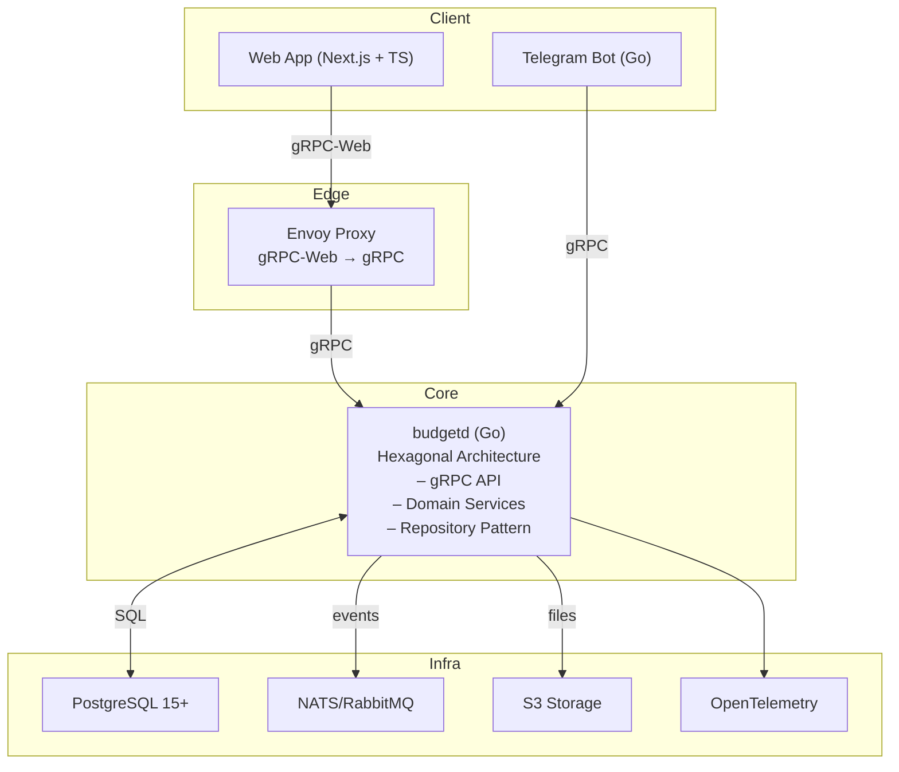

# Budget - Multi-user Income and Expense Tracking

[](https://golang.org/)
[](https://nextjs.org/)
[](https://www.typescriptlang.org/)
[](https://www.postgresql.org/)
[](https://www.docker.com/)

[](https://github.com/positron48/budget/actions/workflows/ci.yml)
[](https://github.com/positron48/budget/actions/workflows/security.yml)
[](https://github.com/positron48/budget/actions/workflows/generate-stubs.yml)
[](LICENSE)
[](http://makeapullrequest.com)
[](https://goreportcard.com/report/github.com/positron48/budget)
[](https://codecov.io/gh/positron48/budget)
[](https://dependabot.com/)

<div align="center">

[](https://github.com/positron48/budget/graphs/contributors)
[](https://github.com/positron48/budget/commits)
[](https://github.com/positron48/budget/releases)

</div>

[English](README_EN.md) | [Русский](README.md)

> Modern web application for personal finance tracking with multi-user support, data import/export, and beautiful interface.

## Quick Start

### Prerequisites
- Docker and Docker Compose
- Git

### Installation and Setup
```bash
# Clone repository
git clone https://github.com/positron48/budget
cd budget

# Start entire environment
make up

# Check status
make logs
```

### Access to Services
- **Frontend**: http://localhost:3030
- **Backend gRPC**: localhost:8080
- **Grafana**: http://localhost:3002
- **Prometheus**: http://localhost:9090

### First Steps
1. Open http://localhost:3030
2. Register with email/password
3. Create your first organization
4. Start adding categories and transactions

## Key Features

### Transaction Management
- ✅ CRUD operations for transactions (income/expense)
- ✅ Categorization with i18n support
- ✅ Filtering and search with quick filters
- ✅ Pagination and sorting
- ✅ CSV export with filters

### Analytics and Reports
- ✅ Monthly reports by categories
- ✅ Data visualization with charts
- ✅ Period comparison
- ✅ Income and expense statistics

### Data Import/Export
- ✅ CSV file import with mapping configuration
- ✅ Automatic encoding detection
- ✅ Data preview
- ✅ Export with all filters applied

### Multi-user Support
- ✅ Multi-tenant architecture
- ✅ Roles: Owner, Admin, Member
- ✅ Organization management
- ✅ Data isolation between accounts

### Internationalization
- ✅ Support for Russian and English languages
- ✅ Localized categories
- ✅ Automatic language switching

## Architecture



## Technology Stack

### Backend
- **Go 1.23+** - main server language
- **gRPC** - API protocol with protobuf
- **PostgreSQL 15+** - main database
- **Argon2id** - password hashing
- **JWT** - authentication with refresh tokens

### Frontend
- **Next.js 14** - React framework
- **TypeScript** - typed JavaScript
- **Tailwind CSS** - utility CSS framework
- **TanStack Query** - state management
- **Connect-Web** - gRPC client for browser

### DevOps
- **Docker** - containerization
- **Prometheus + Grafana** - monitoring
- **OpenTelemetry** - tracing and metrics
- **GitHub Actions** - CI/CD

## Deployment

### Local Development
```bash
# Start entire environment
make up

# Stop
make down

# Checks
make check

# Generate protobuf
make proto

# Database migrations
make migrate-up
```

### Production
```bash
# Build and start
docker-compose -f docker-compose.yml up -d

# Monitoring
docker-compose -f docker-compose.yml logs -f
```

## Project Structure

```
budget/
├── 📁 cmd/budgetd/              # Backend entry point
├── 📁 internal/                 # Backend business logic
│   ├── 📁 domain/              # Domain entities
│   ├── 📁 usecase/             # Application services
│   ├── 📁 adapter/             # Infrastructure adapters
│   └── 📁 pkg/                 # Shared utilities
├── 📁 web/                     # Frontend (Next.js)
│   ├── 📁 app/                 # Next.js App Router
│   ├── 📁 components/          # React components
│   ├── 📁 lib/                 # Utilities and API clients
│   └── 📁 i18n/                # Internationalization
├── 📁 proto/                   # gRPC schemas
├── 📁 migrations/              # Database migrations
├── 📁 deploy/                  # Docker and monitoring
└── 📁 docs/                    # Documentation
```

## Main Commands

| Command | Description |
|---------|-------------|
| `make up` | Start entire environment |
| `make down` | Stop all services |
| `make check` | Backend + frontend checks |
| `make proto` | Generate protobuf code |
| `make migrate-up` | Apply database migrations |
| `make test` | Run tests |
| `make logs` | View logs |

## Roadmap

### In Development
- **Telegram bot** for quick transaction addition
- **Bank integrations** for automatic import
- **Budget planning** and financial goals

### Planned
- **Mobile application** (React Native)
- **E2E tests** with Playwright
- **Performance optimizations**
- **PWA functionality**
- **Offline mode**
- **Push notifications**

## Contributing

We welcome contributions to the project! Please read our [contributing guidelines](CONTRIBUTING.md).

### How to help:
1. **Report a bug** - create an issue
2. **Suggest an idea** - create a feature request
3. **Fix a bug** - create a pull request
4. **Improve documentation** - edit README

## License

This project is licensed under the Creative Commons Attribution-NonCommercial 4.0 International License - see the [LICENSE](LICENSE) file for details.

## Acknowledgments

- [Go](https://golang.org/) - for the excellent programming language
- [Next.js](https://nextjs.org/) - for the modern React framework
- [Tailwind CSS](https://tailwindcss.com/) - for the utility CSS
- [gRPC](https://grpc.io/) - for the efficient API protocol

---

**⭐ If you like the project, give it a star!**
