# 💰 Budget - Multi-user Income and Expense Tracking

[](https://golang.org/)
[](https://nextjs.org/)
[](https://www.typescriptlang.org/)
[](https://www.postgresql.org/)
[](https://www.docker.com/)

[](https://github.com/your-username/budget/actions)
[](https://github.com/your-username/budget/actions)
[](LICENSE)
[](http://makeapullrequest.com)

[English](README_EN.md) | [Русский](README.md)

> Modern web application for personal finance tracking with multi-user support, data import/export, and beautiful interface.

## 🚀 Quick Start

### Prerequisites
- Docker and Docker Compose
- Git

### Installation and Setup
```bash
# Clone repository
git clone <repository>
cd budget

# Start entire environment
make up

# Check status
make logs
```

### Access to Services
- 🌐 **Frontend**: http://localhost:3030
- 🔧 **Backend gRPC**: localhost:8080
- 📊 **Grafana**: http://localhost:3002
- 📈 **Prometheus**: http://localhost:9090

### First Steps
1. Open http://localhost:3030
2. Register with email/password
3. Create your first organization
4. Start adding categories and transactions

## ✨ Key Features

### 💳 Transaction Management
- ✅ CRUD operations for transactions (income/expense)
- ✅ Categorization with i18n support
- ✅ Filtering and search with quick filters
- ✅ Pagination and sorting
- ✅ CSV export with filters

### 📊 Analytics and Reports
- ✅ Monthly reports by categories
- ✅ Data visualization with charts
- ✅ Period comparison
- ✅ Income and expense statistics

### 🔄 Data Import/Export
- ✅ CSV file import with mapping configuration
- ✅ Automatic encoding detection
- ✅ Data preview
- ✅ Export with all filters applied

### 👥 Multi-user Support
- ✅ Multi-tenant architecture
- ✅ Roles: Owner, Admin, Member
- ✅ Organization management
- ✅ Data isolation between accounts

### 🌍 Internationalization
- ✅ Support for Russian and English languages
- ✅ Localized categories
- ✅ Automatic language switching

## 🏗️ Architecture

```mermaid
flowchart TB
  subgraph Client
    Web["🌐 Web App (Next.js + TS)"]
    TG["📱 Telegram Bot (Go) 📋"]
  end

  subgraph Edge
    Envoy["🔄 Envoy Proxy<br/>gRPC-Web → gRPC"]
  end

  subgraph Core
    Budgetd["⚙️ budgetd (Go)<br/>Hexagonal Architecture<br/>– gRPC API<br/>– Domain Services<br/>– Repository Pattern"]
  end

  subgraph Infra
    PG["🗄️ PostgreSQL 15+"]
    MQ["📨 NATS/RabbitMQ 📋"]
    S3["☁️ S3 Storage 📋"]
    OTEL["📊 OpenTelemetry"]
  end

  Web -->|gRPC-Web| Envoy -->|gRPC| Budgetd
  TG -->|gRPC| Budgetd
  Budgetd <-->|SQL| PG
  Budgetd -->|events| MQ
  Budgetd -->|files| S3
  Budgetd --> OTEL
```



## 🛠️ Technology Stack

### Backend
- **Go 1.23+** - main server language
- **gRPC** - API protocol with protobuf
- **PostgreSQL 15+** - main database
- **Argon2id** - password hashing
- **JWT** - authentication with refresh tokens

### Frontend
- **Next.js 14** - React framework
- **TypeScript** - typed JavaScript
- **Tailwind CSS** - utility CSS framework
- **TanStack Query** - state management
- **Connect-Web** - gRPC client for browser

### DevOps
- **Docker** - containerization
- **Prometheus + Grafana** - monitoring
- **OpenTelemetry** - tracing and metrics
- **GitHub Actions** - CI/CD

## 📊 Implementation Status

| Component | Status | Description |
|-----------|--------|-------------|
| 🔐 **Authentication** | ✅ Ready | Registration, login, JWT tokens |
| 👤 **Users** | ✅ Ready | Profiles, password change |
| 🏢 **Organizations** | ✅ Ready | Multi-tenant, roles |
| 📂 **Categories** | ✅ Ready | CRUD with i18n |
| 💰 **Transactions** | ✅ Ready | CRUD, filters, pagination |
| 📈 **Reports** | ✅ Ready | Monthly analytics |
| 💱 **Currency Rates** | ✅ Ready | FX management |
| 📥 **Import** | ✅ Ready | CSV with mapping |
| 📤 **Export** | ✅ Ready | CSV with filters |
| 🌐 **Frontend** | ✅ Ready | Modern UI/UX |
| 📊 **Monitoring** | ✅ Ready | Prometheus + Grafana |
| 🧪 **Tests** | ✅ Ready | Unit + Integration |

## 🧪 Testing

```bash
# Backend tests
make test

# Frontend tests
cd web && npm test

# All tests
make check
```

**Test Results:**
- ✅ **13 tests** - all passing
- ✅ **Backend** - unit and integration tests
- ✅ **Frontend** - component tests
- ✅ **API** - gRPC integration tests

## 🚀 Deployment

### Local Development
```bash
# Start entire environment
make up

# Stop
make down

# Checks
make check

# Generate protobuf
make proto

# Database migrations
make migrate-up
```

### Production
```bash
# Build and start
docker-compose -f docker-compose.yml up -d

# Monitoring
docker-compose -f docker-compose.yml logs -f
```

## 📁 Project Structure

```
budget/
├── 📁 cmd/budgetd/              # Backend entry point
├── 📁 internal/                 # Backend business logic
│   ├── 📁 domain/              # Domain entities
│   ├── 📁 usecase/             # Application services
│   ├── 📁 adapter/             # Infrastructure adapters
│   └── 📁 pkg/                 # Shared utilities
├── 📁 web/                     # Frontend (Next.js)
│   ├── 📁 app/                 # Next.js App Router
│   ├── 📁 components/          # React components
│   ├── 📁 lib/                 # Utilities and API clients
│   └── 📁 i18n/                # Internationalization
├── 📁 proto/                   # gRPC schemas
├── 📁 migrations/              # Database migrations
├── 📁 deploy/                  # Docker and monitoring
└── 📁 docs/                    # Documentation
```

## 🔧 Main Commands

| Command | Description |
|---------|-------------|
| `make up` | Start entire environment |
| `make down` | Stop all services |
| `make check` | Backend + frontend checks |
| `make proto` | Generate protobuf code |
| `make migrate-up` | Apply database migrations |
| `make test` | Run tests |
| `make logs` | View logs |

## 🌍 Internationalization

The application fully supports **Russian** and **English** languages:

- ✅ **Backend**: i18n for categories and messages
- ✅ **Frontend**: complete interface localization
- ✅ **Automatic language switching**
- ✅ **Saving** selected language in profile

## 🔐 Security

- ✅ **Argon2id** password hashing
- ✅ **JWT** with access/refresh tokens
- ✅ **Multi-tenant** data isolation
- ✅ **Roles** in accounts (Owner/Admin/Member)
- ✅ **Validation** at all levels
- ✅ **Automatic token refresh**

## 📈 Monitoring

- ✅ **Prometheus** metrics
- ✅ **OpenTelemetry** tracing
- ✅ **Grafana** dashboards
- ✅ **Structured** logging

## 🎨 UI/UX

- ✅ **Modern design** with Tailwind CSS
- ✅ **Responsive layout** for all devices
- ✅ **Smooth animations** and transitions
- ✅ **Intuitive navigation**
- ✅ **Feedback** for all actions

## 📋 Roadmap

### 🚧 In Development
- 📱 **Telegram bot** for quick transaction addition
- 🏦 **Bank integrations** for automatic import
- 📊 **Budget planning** and financial goals

### 🔮 Planned
- 📱 **Mobile application** (React Native)
- 🧪 **E2E tests** with Playwright
- ⚡ **Performance optimizations**
- 📱 **PWA functionality**
- 🔄 **Offline mode**
- 🔔 **Push notifications**

## 🤝 Contributing

We welcome contributions to the project! Please read our [contributing guidelines](CONTRIBUTING.md).

### How to help:
1. 🐛 **Report a bug** - create an issue
2. 💡 **Suggest an idea** - create a feature request
3. 🔧 **Fix a bug** - create a pull request
4. 📚 **Improve documentation** - edit README

## 📄 License

This project is licensed under the MIT License - see the [LICENSE](LICENSE) file for details.

## 🙏 Acknowledgments

- [Go](https://golang.org/) - for the excellent programming language
- [Next.js](https://nextjs.org/) - for the modern React framework
- [Tailwind CSS](https://tailwindcss.com/) - for the utility CSS
- [gRPC](https://grpc.io/) - for the efficient API protocol

---

**⭐ If you like the project, give it a star!**

**Project Status**: ✅ **MVP Ready for Use**

All main features are implemented and tested. The application is ready for production use with basic personal finance tracking functionality.
